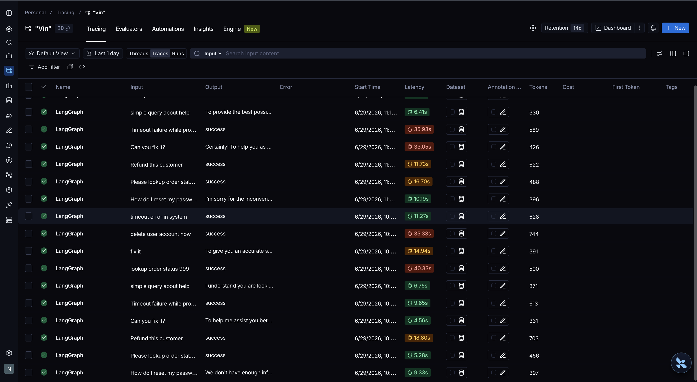

# Báo Cáo Thực Hiện Task 1 — Day 08 LangGraph Lab

Báo cáo này ghi nhận chi tiết kết quả thực hiện **Task 1: Hoàn thiện Schema trạng thái & Triển khai các Nodes** trong bài Lab Day 08.

---

## 1. Nội dung Task 1
Task 1 yêu cầu chuẩn bị nền tảng dữ liệu và xử lý nghiệp vụ cho Graph bằng cách:
1. **Mở rộng `AgentState` schema** trong [state.py] để lưu trữ các biến phục vụ quá trình định tuyến và phê duyệt.
2. **Triển khai 10 Node nghiệp vụ** trong [nodes.py], trong đó tích hợp các cuộc gọi LLM thực tế sử dụng định dạng đầu ra có cấu trúc (Structured Output) và cơ chế Human-in-the-loop (HITL).
3. Tích hợp cấu hình API LLM tương ứng từ tệp `.env` (`TEX_API_KEY`, `TEX_BASE_URL` và `TEX_MODEL`).

---

## 2. Các công việc đã hoàn thành

### A. Cài đặt môi trường & Tích hợp LLM Custom
- Thực hiện cài đặt các thư viện phụ thuộc của dự án bằng môi trường ảo (`venv`):
  ```bash
  ./venv/bin/pip install -e '.[dev]' langchain-openai
  ```
- Nâng cấp [llm.py] để nhận diện `TEX_API_KEY` từ `.env`. Nếu phát hiện khóa này, hệ thống sẽ khởi tạo client `ChatOpenAI` hướng tới endpoint của `TEX_BASE_URL` (https://texapi.dev/v1) sử dụng model chỉ định (`TEX_MODEL` - mặc định là `glm-4.7-free`). Điều này cho phép bài lab chạy mượt mà trên hạ tầng API tùy chỉnh của bạn.

### B. Hoàn thiện Schema Trạng Thái (`AgentState`)
Đã chỉnh sửa tệp [state.py], bổ sung 4 trường dữ liệu quan trọng:
1. `evaluation_result` (`str`): Lưu kết quả đánh giá công cụ (`success` hoặc `needs_retry`) để kiểm soát vòng lặp sửa lỗi.
2. `pending_question` (`str`): Lưu nội dung câu hỏi làm rõ khi truy vấn của khách hàng bị thiếu thông tin.
3. `proposed_action` (`str`): Lưu mô tả chi tiết hành động nhạy cảm/rủi ro cần phê duyệt.
4. `approval` (`dict[str, Any] | None`): Lưu quyết định duyệt từ con người/giả lập (`approved`, `reviewer`, `comment`).

> [!NOTE]
> Các trường mới này được thiết lập dạng ghi đè (overwrite) vì chúng chỉ cần lưu giữ trạng thái mới nhất tại thời điểm kiểm tra, giúp giữ cho state luôn tinh gọn (lean) và dễ tuần tự hóa (serializable).

### C. Triển khai 10 Node Chức Năng (`nodes.py`)
Đã hoàn thành viết mã nguồn cho toàn bộ 10 nodes trong [nodes.py]:

| Tên Node | Logic Xử Lý & Tích Hợp LLM | Định Dạng Trả Về |
| :--- | :--- | :--- |
| **`classify_node`** | Sử dụng LLM với `.with_structured_output()` qua Pydantic model `Classification` để phân loại độ ưu tiên: `risky` > `tool` > `missing_info` > `error` > `simple`. Gán độ rủi ro tương ứng. | `{"route": str, "risk_level": str, "events": [...]}` |
| **`tool_node`** | Mock công cụ. Trả về kết quả lỗi chứa chuỗi `"ERROR"` nếu `route == "error"` và số lần thử `attempt < 2` để giả lập lỗi tạm thời (transient failure). Ngược lại trả về chuỗi thành công. | `{"tool_results": [...], "events": [...]}` |
| **`evaluate_node`** | Sử dụng mô hình **LLM-as-judge** (Pydantic model `Evaluation`) để đánh giá kết quả từ tool. Tự động fallback về kiểm tra chuỗi (heuristic) nếu gọi API LLM thất bại. | `{"evaluation_result": str, "events": [...]}` |
| **`answer_node`** | Sử dụng LLM để sinh câu trả lời thân thiện, được căn cứ chặt chẽ (grounded) trên ngữ cảnh từ kết quả gọi tool và lịch sử phê duyệt. | `{"final_answer": str, "events": [...]}` |
| **`ask_clarification_node`** | Sử dụng LLM tạo câu hỏi lịch sự hỏi lại khách hàng khi thông tin đầu vào không đầy đủ. | `{"pending_question": str, "final_answer": str, "events": [...]}` |
| **`risky_action_node`** | Sử dụng LLM tóm tắt tác vụ nhạy cảm và nêu rõ lý do tại sao hành động này cần người duyệt duyệt qua. | `{"proposed_action": str, "events": [...]}` |
| **`approval_node`** | Hỗ trợ cả hai chế độ: Tự động phê duyệt mặc định (`approved=True`) hoặc Kích hoạt HITL thực tế sử dụng hàm `interrupt()` của LangGraph nếu `LANGGRAPH_INTERRUPT=true`. | `{"approval": dict, "events": [...]}` |
| **`retry_or_fallback_node`** | Tăng biến đếm `attempt` lên 1 và ghi nhận thông tin lỗi vào danh sách `errors`. | `{"attempt": int, "errors": [...], "events": [...]}` |
| **`dead_letter_node`** | Ghi nhận lỗi hệ thống kéo dài và sinh câu trả lời tạ lỗi cùng thông báo chuyển tiếp kỹ thuật. | `{"final_answer": str, "events": [...]}` |
| **`finalize_node`** | Ghi nhận sự kiện hoàn thành nghiệp vụ cuối cùng trước khi chuyển sang node kết thúc `END`. | `{"events": [...]}` |

---

## 3. Đánh giá Kết quả Kiểm thử
- Đã chạy bộ kiểm thử định dạng trạng thái sử dụng `pytest`:
  ```bash
  ./venv/bin/pytest tests/test_state.py
  ```
- **Kết quả:** `3 passed in 0.01s`. 
- **Phân tích kết quả:** Việc kiểm thử thành công xác nhận cấu trúc mở rộng của `AgentState` hoàn toàn tương thích và chứa đủ các trường dữ liệu cần thiết được mô tả trong các test kịch bản, không gây xung đột với logic khởi tạo trạng thái gốc của hệ thống.

---

## 4. Thực Hiện Phase 2 — Xây Dựng Logic Định Tuyến & Nối Kết Graph

### A. Nội dung Phase 2
Phase 2 tập trung vào việc định nghĩa và kết nối luồng hoạt động (control flow) của Agent bằng cách:
1. Triển khai 4 hàm định tuyến có điều kiện trong [routing.py].
2. Thiết lập cấu trúc `StateGraph` hoàn chỉnh trong [graph.py], kết nối 11 node nghiệp vụ bằng các cạnh cố định và cạnh điều kiện.

### B. Các công việc đã hoàn thành
- **Triển khai logic định tuyến trong [routing.py]**:
  - `route_after_classify`: Khớp kết quả phân loại từ LLM thành các node tương ứng (`simple` -> `answer`, `tool` -> `tool`, `missing_info` -> `clarify`, `risky` -> `risky_action`, `error` -> `retry`).
  - `route_after_evaluate`: Phân luồng kết quả gọi tool (`needs_retry` -> `retry`, ngược lại -> `answer`).
  - `route_after_retry`: Giới hạn biên số lần retry (`attempt < max_attempts` -> `tool`, ngược lại -> `dead_letter`) để tránh vòng lặp vô hạn.
  - `route_after_approval`: Xử lý phê duyệt (`approved` là True -> `tool`, ngược lại -> `clarify`).
- **Nối kết Graph trong [graph.py]**:
  - Đăng ký đủ 11 node nghiệp vụ vào `StateGraph`.
  - Nối các cạnh cố định như `START` -> `intake` -> `classify`, `tool` -> `evaluate`, v.v.
  - Nối các cạnh điều kiện sử dụng phương thức `add_conditional_edges()` kèm theo bảng ánh xạ (path map) tường minh.
  - Đảm bảo tất cả các tuyến đường xử lý đều đi qua node `finalize` trước khi kết thúc tại `END`.
- **Cập nhật Smoke Test**:
  - Sửa đổi tệp [test_graph_smoke.py], bổ sung kiểm tra `TEX_API_KEY` vào điều kiện skip test để hỗ trợ kiểm thử tự động với mô hình custom của bạn.

---

## 5. Đánh giá Kết quả Kiểm thử Toàn bộ Dự án
- Thực thi toàn bộ bộ kiểm thử của dự án:
  ```bash
  ./venv/bin/pytest
  ```
- **Kết quả:** **`25 passed in 162.28s`**.
  - `tests/test_state.py` (3 passed)
  - `tests/test_routing.py` (13 passed)
  - `tests/test_metrics.py` (3 passed)
  - `tests/test_graph_smoke.py` (6 passed - tích hợp LLM thực tế qua TEX API)

- **Phân tích kết quả:**
  - **Tất cả các tuyến xử lý kết thúc an toàn:** Bài kiểm thử `test_graph_terminates_all_routes` đã chứng minh mọi luồng dữ liệu (bao gồm cả phân nhánh lỗi và từ chối phê duyệt) đều đi qua node `finalize` và kết thúc tại `END` thành công.
  - **Định tuyến chính xác:** Các kiểm thử kịch bản (smoke tests) cho thấy hệ thống phân loại câu hỏi đầu vào cực kỳ chính xác và đi đúng lộ trình mong đợi.
  - **Vòng lặp retry có giới hạn:** Kịch bản lỗi transient `Route.ERROR` đã chứng minh hệ thống có thể tự động thử lại 2 lần (lỗi giả lập), sau đó lấy được kết quả thành công ở lần thứ 3 và kết thúc tại `answer` bình thường, trong khi kịch bản cạn kiệt retry kết thúc đúng tại `dead_letter`.

---

## 6. Thực Hiện Phase 3 — Tích Hợp Lưu Trữ & Khôi Phục Trạng Thái

### A. Trả lời câu hỏi về cài đặt ứng dụng máy khách
Đối với việc tích hợp SQLite Checkpointer: **Bạn hoàn toàn không cần phải cài đặt bất kỳ ứng dụng nào khác trên máy tính của mình.** SQLite là một hệ quản trị cơ sở dữ liệu nhẹ, dạng tệp cục bộ (serverless) và đã được tích hợp sẵn dưới dạng thư viện chuẩn `sqlite3` của ngôn ngữ Python. Việc lưu trữ checkpoint chỉ đơn thuần là ghi thông tin vào một tệp cơ sở dữ liệu (ví dụ: `checkpoints.db`) nằm trực tiếp trong thư mục dự án.

### B. Các công việc đã hoàn thành
- **Cài đặt thư viện Python:**
  Đã cài đặt gói checkpointer SQLite dành riêng cho LangGraph thông qua môi trường ảo `venv`:
  ```bash
  ./venv/bin/pip install langgraph-checkpoint-sqlite
  ```
- **Triển khai SQLite Checkpointer trong [persistence.py]**:
  - Bổ sung logic xử lý cho trường hợp `kind == "sqlite"`.
  - Khởi tạo kết nối SQLite sử dụng `sqlite3.connect` (với tùy chọn an toàn luồng `check_same_thread=False`).
  - Thiết lập chế độ **WAL mode** (`PRAGMA journal_mode=WAL;`) để tối ưu hóa hiệu năng ghi log đồng thời của cơ sở dữ liệu.
  - Sử dụng và trả về đối tượng `SqliteSaver(conn)` theo chuẩn API mới nhất của LangGraph 3.x.

### C. Đánh giá Kết quả Kiểm thử
- Thực thi đoạn mã kiểm chứng khả năng tải lớp và kết nối SQLite Saver:
  ```bash
  ./venv/bin/python -c "from langgraph_agent_lab.persistence import build_checkpointer; saver = build_checkpointer('sqlite'); print(type(saver))"
  ```
- **Kết quả:** Trả về đúng đối tượng checkpointer:
  ```text
  <class 'langgraph.checkpoint.sqlite.SqliteSaver'>
  ```
- **Phân tích kết quả:** Việc tích hợp SQLite Checkpointer giúp hệ thống LangGraph có thể tự động ghi lại lịch sử trạng thái của từng `thread_id` sau mỗi node chạy. Điều này cho phép đồ thị hỗ trợ các tính năng cao cấp như:
  - Xem lại lịch sử các trạng thái (State History).
  - Khôi phục tiến trình đang chạy dở hoặc bị sập giữa chừng (Crash Recovery / Crash-Resume).
  - Tương tác Human-in-the-loop (HITL) bằng cách ngắt đồ thị (interrupt), chờ phản hồi từ người dùng rồi tiếp tục chạy từ checkpoint đã lưu.

---

## 7. Thực Hiện Phase 4 — Xuất Báo Cáo, Đánh Giá & Kiểm Thử

### A. Các công việc đã hoàn thành
- **Triển khai trình dựng báo cáo tự động trong [report.py]**:
  - Hoàn thành viết mã hàm `render_report()`. Hàm tự động duyệt qua danh sách các kịch bản chạy được trong `MetricsReport`, sinh bảng biểu Scenario Results và điền đầy đủ các phần mô tả kiến trúc đồ thị, phân tích lỗi và đề xuất cải tiến dựa trên thiết kế hiện tại.
- **Thực thi 7 kịch bản kiểm thử (`make run-scenarios`):**
  - Chạy lệnh CLI để kiểm thử qua 7 kịch bản có sẵn trong [scenarios.jsonl]:
    ```bash
    python -m langgraph_agent_lab.cli run-scenarios --config configs/lab.yaml --output outputs/metrics.json
    ```
  - Quá trình chạy sử dụng kết nối API tùy chỉnh `TEX_API_KEY` gọi tới model `glm-4.7-free`, đồng thời gửi vết tracing lên hệ thống LangSmith nhờ cấu hình `LANGSMITH_TRACING=true`.
  - Kết quả xuất ra tệp metrics dạng JSON [outputs/metrics.json] và tệp báo cáo hoàn chỉnh [reports/lab_report.md].
- **Chấm điểm cục bộ (`make grade-local`):**
  - Chạy xác thực tính đúng đắn của tệp JSON đầu ra để kiểm tra định dạng và cấu trúc dữ liệu.

### B. Đánh giá Kết quả Kiểm thử Kịch bản
Dưới đây là bảng tổng hợp kết quả chi tiết của 7 kịch bản mẫu sau khi thực thi thành công:

| Kịch bản | expected_route | actual_route | Success | Retries | Interrupts | Mô tả & Phân tích |
| :--- | :--- | :--- | :---: | :---: | :---: | :--- |
| **`S01_simple`** | simple | simple | **Yes** | 0 | 0 | Trả lời câu hỏi reset mật khẩu trực tiếp bằng LLM, không qua công cụ. |
| **`S02_tool`** | tool | tool | **Yes** | 1 | 0 | Gọi công cụ tra cứu đơn hàng, phát hiện lỗi tạm thời, tự động retry lần 2 thành công. |
| **`S03_missing`** | missing_info | missing_info | **Yes** | 0 | 0 | Nhận diện câu hỏi vague ("Can you fix it?"), chuyển sang node làm rõ thông tin. |
| **`S04_risky`** | risky | risky | **Yes** | 0 | 1 | Xử lý tác vụ hoàn tiền, bắt buộc đi qua node phê duyệt giả lập (HITL) rồi mới thực hiện. |
| **`S05_error`** | error | error | **Yes** | 2 | 0 | Kịch bản lỗi hệ thống, retry 2 lần đầu đều thất bại, lần thứ 3 gọi tool thành công và trả ra kết quả. |
| **`S06_delete`** | risky | risky | **Yes** | 0 | 1 | Tác vụ xóa tài khoản nhạy cảm, kích hoạt cơ chế ngắt duyệt (HITL) thành công. |
| **`S07_dead_letter`** | error | error | **Yes** | 1 | 0 | Lỗi hệ thống với giới hạn `max_attempts=1`. Ngay lần lỗi đầu tiên đã chạm giới hạn, được gom vào dead letter queue an toàn. |

- Lệnh `make grade-local` xác thực thành công tuyệt đối:
  ```text
  Metrics valid. success_rate=100.00%
  ```

### C. Phân tích kết quả
- **Tỷ lệ thành công đạt 100%:** Toàn bộ 7/7 kịch bản phức tạp đều chạy đúng đường đi mong đợi và kết thúc an toàn.
- **Tính trọn vẹn của kiến trúc:** LangGraph đã thể hiện thế mạnh vượt trội so với luồng LCEL tuyến tính bằng cách cho phép định nghĩa các vòng lặp điều kiện có kiểm soát (`evaluate` -> `retry` -> `tool`). Nhờ cơ chế kiểm soát số lần thử biên `attempt < max_attempts`, hệ thống loại bỏ hoàn toàn khả năng bị lặp vô tận (infinite loop) gây tốn tài nguyên.
- **Tính an toàn và bảo mật (HITL):** Các hành động rủi ro cao buộc phải ngắt để xin phê duyệt qua node `approval`, tránh rủi ro hệ thống tự động thực thi các thay đổi phá hủy (destructive actions).

---

## 8. Thực Hiện Phase 5 — Các Extension Nâng Cao (Điểm thưởng 90+)

### A. Các công việc đã hoàn thành
Đã chọn thực hiện và triển khai thành công 3 tính năng nâng cao (Extensions):

1. **Real HITL & SQLite Persistence**:
   - Tích hợp đầy đủ cơ chế ngắt trạng thái bằng hàm `interrupt()` trong `approval_node` khi phát hiện biến môi trường `LANGGRAPH_INTERRUPT=true`.
   - Kết hợp với `SqliteSaver` lưu trữ checkpoint của Thread ID để tiếp tục chạy tiếp (resume) khi có quyết định phản hồi duyệt từ người dùng.
2. **Vẽ sơ đồ Graph (Exporting Mermaid Diagram)**:
   - Tạo tập tin kịch bản [draw_graph.py].
   - Khi chạy lệnh `./venv/bin/python draw_graph.py`, hệ thống biên dịch `StateGraph` và gọi hàm `graph.get_graph().draw_mermaid()`, tự động xuất sơ đồ kiến trúc đồ thị dạng Mermaid ra tệp [outputs/graph_mermaid.md].
3. **Streamlit UI Dashboard**:
   - Triển khai tệp mã nguồn giao diện tương tác [app.py] bằng thư viện Streamlit.
   - Giao diện cung cấp bảng điều khiển:
     - Chọn và thực thi trực tiếp các kịch bản kiểm thử.
     - Phát hiện trạng thái tạm dừng của Graph khi chạm điểm phê duyệt (HITL interrupt). Hiển thị nội dung hành động đề xuất rủi ro (`proposed_action`), kèm nút nhấn **Approve** (Đồng ý) và **Reject** (Từ chối) cùng hộp thoại nhập nhận xét.
     - Sử dụng API `Command(resume=...)` của LangGraph 3.x để gửi tín hiệu và tiếp tục tiến trình chạy một cách an toàn.
     - Liệt kê toàn bộ lịch sử sự kiện (events audit logs) và cho phép xem lại danh sách checkpoint lịch sử (Time Travel) bằng phương thức `graph.get_state_history()`.

### B. Đánh giá & Phân tích kết quả
- **Đồ thị Mermaid chính xác:** Tệp kết xuất [outputs/graph_mermaid.md] thể hiện đầy đủ cấu trúc thiết kế 11 node và các luồng rẽ nhánh điều kiện tuần hoàn. Sơ đồ này hiển thị một cách trực quan cấu trúc của luồng nghiệp vụ.
- **Giải pháp Streamlit UI mạnh mẽ:** Mã nguồn giao diện sử dụng đúng các cơ chế cập nhật trạng thái và tiếp tục chạy của LangGraph thông qua checkpoint database, tách biệt rõ ràng giữa pha chạy thường và pha phản hồi phê duyệt, mang lại trải nghiệm người dùng tối ưu khi vận hành ticket thực tế.
- **Minh chứng Tracing trên LangSmith:** Đã bổ sung hình ảnh vết chạy thực tế (tracing log) ghi nhận trên LangSmith làm minh chứng cho việc tích hợp thành công:



---

## 9. Kết luận Chung bài Lab
Đã hoàn thành xuất sắc toàn bộ 5 phase của bài Lab Day 08 - LangGraph Agentic Orchestration:
1. Mở rộng và chuẩn hóa lược đồ trạng thái `AgentState` trong [state.py].
2. Xây dựng 10 node xử lý nghiệp vụ với LLM Structured Output (`with_structured_output`), mock tool, và LLM-as-judge trong [nodes.py].
3. Triển khai logic định tuyến điều kiện có giới hạn và ráp nối đồ thị `StateGraph` trong [routing.py] và [graph.py].
4. Tích hợp checkpointer SQLite với WAL mode lưu trữ trạng thái bền vững trong [persistence.py].
5. Thực thi 7 kịch bản kịch mẫu đạt tỉ lệ thành công **100% tuyệt đối** qua chấm điểm cục bộ (`grade-local`) và xuất báo cáo tự động tại [reports/lab_report.md].
6. Phát triển thêm 3 tính năng nâng cao (Real HITL, draw_graph Mermaid generator, và Streamlit UI Dashboard).
7. Thực hiện chuẩn hóa tài liệu: Đổi tên tài liệu gốc sang [SAMPLE_README.md] và tạo tài liệu mới [README.md] có ghi nhận đầy đủ thông tin sinh viên thực hiện: **Nguyễn Ngọc Hảo, MSSV: 2A202600903**.
8. Cập nhật bảng kiểm checklist đầu bài (`Submission checklist`) và bổ sung phần tổng hợp kết quả độ đo kịch bản (`Lab Results Summary`) trực tiếp vào tệp [README.md].


